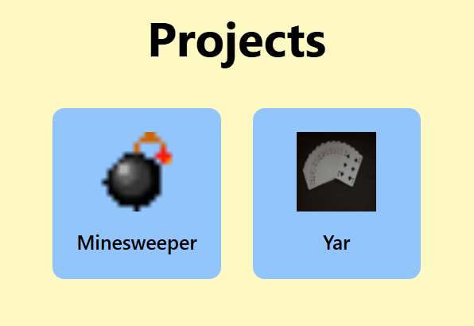
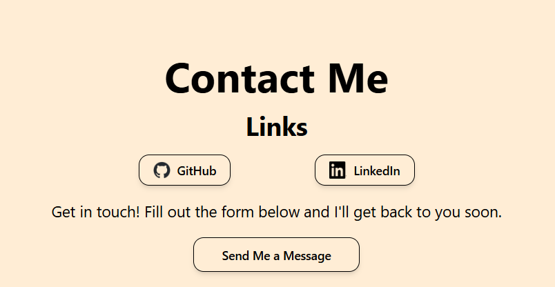

# Personal Portfolio Website

A modern, responsive portfolio website showcasing projects, skills, and experience designed to impress clients and potential employers.

## 🔗 Live Demo
**[View Live Site](https://justin-ott.vercel.app/)** 

---

## 📸 Screenshots


*Main landing page with featured projects*


*Showcase of featured work and case studies*


*Professional contact section with Firebase integration*!

---

## 🛠 Tech Stack

- **Frontend Framework:** React 18
- **Build Tool:** Vite
- **Styling:** Tailwind CSS + PostCSS
- **Form Handling:** Firebase
- **Deployment:** Vercel
- **Build Tool Configuration:** ESLint

---

## ✨ Features

- ✅ **Responsive Design** - Optimized for all devices (mobile, tablet, desktop)
- ✅ **Modern UI/UX** - Clean, professional interface with smooth interactions
- ✅ **Project Portfolio** - Showcase your best work with detailed descriptions
- ✅ **Contact Integration** - Firebase-powered contact form
- ✅ **Fast Performance** - Vite ensures rapid load times
- ✅ **SEO Ready** - Built with best practices for search engine optimization

---

## 📂 Project Structure

```
portfolio/
├── src/
│   ├── components/        # Reusable React components
│   ├── sections/          # Page sections (Hero, Projects, Contact, etc.)
│   ├── firebase/          # Firebase configuration
│   ├── assets/            # Images, icons, media
│   └── App.jsx            # Main app component
├── public/
│   ├── projectIcons/      # Project thumbnails
│   └── downloads/         # Downloadable resources
└── vite.config.js         # Vite configuration
```

---

## 🚀 Quick Start

### Prerequisites
- Node.js 16+ and npm/yarn

### Installation

```bash
# Navigate to project directory
cd Personal-Website/portfolio

# Install dependencies
npm install

# Start development server
npm run dev

# Build for production
npm run build
```

---

## 📋 Task Reference
[Personal Website Spec.pdf](https://github.com/user-attachments/files/24146145/Personal.Website.Spec.pdf)

---

## 📧 Contact & Links

- Portfolio: [(https://justin-ott.vercel.app/)]
- LinkedIn: [https://www.linkedin.com/in/justin-ott/]
- GitHub: [https://github.com/Justin-Ott]
- Email: [justinott140@gmail.com]
s